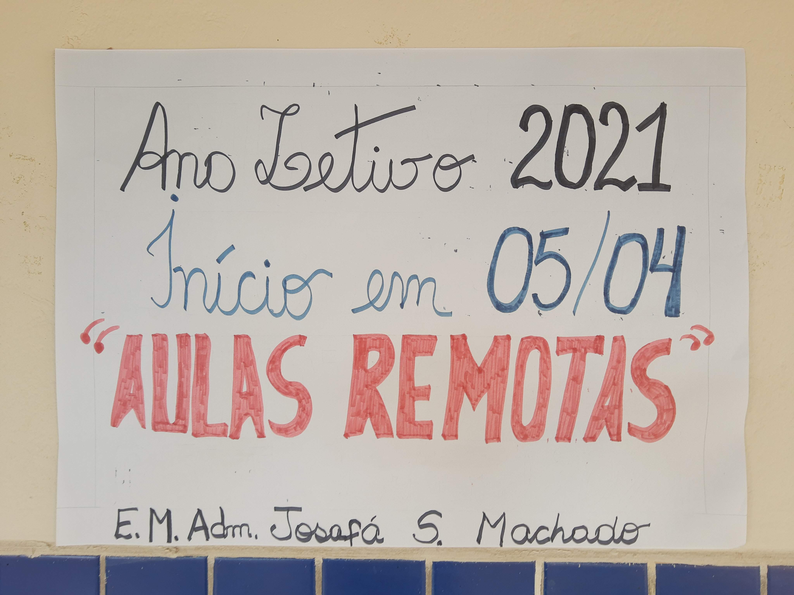
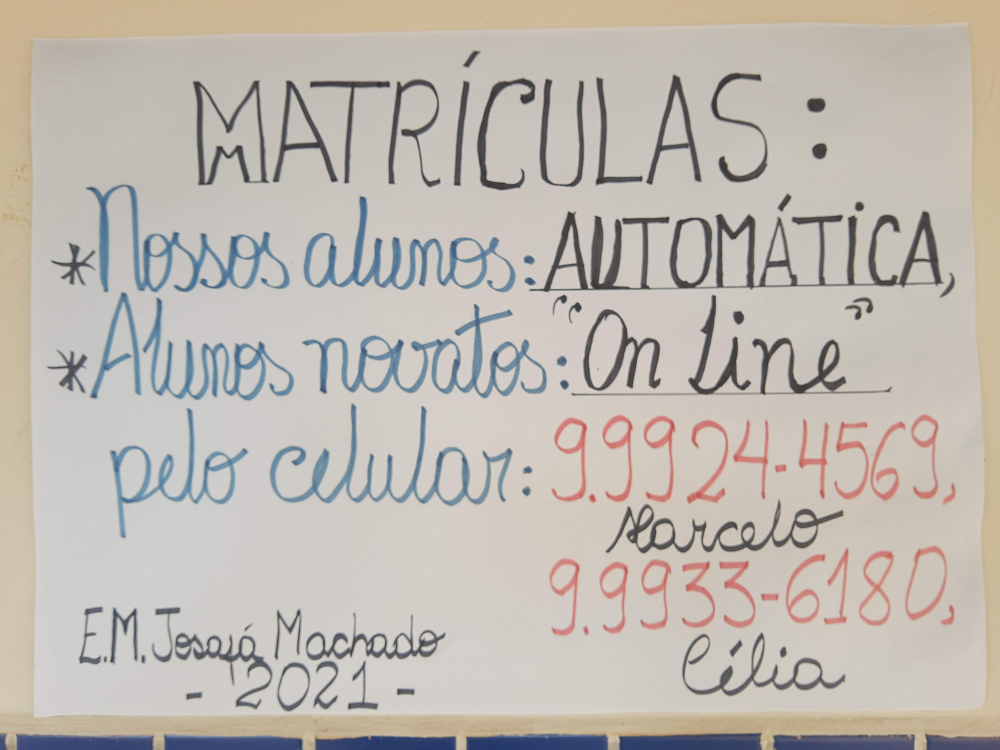

# Ano 2021

O ano letivo de 2021 teve início em 05/abr/2021 com aulas remotas.

As matrículas de nossos alunos foram feitas de forma automática e as dos alunos novatos podem ser feitas _online_ via WhatsApp.

<!-- Por questão de segurança digital, não foi deixado o link para uma conversa do WhatsApp: <https://wa.me/5584999999999> -->